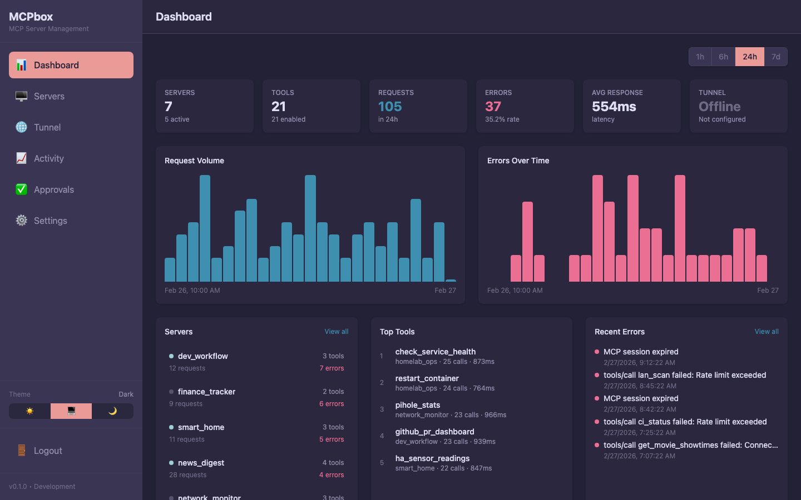

# Quick Start

After [installing MCPBox]({{ site.baseurl }}/getting-started/installation.html), follow these steps to set up your admin account and get familiar with the interface.

## Create Your Admin Account

1. Open [http://localhost:3000](http://localhost:3000) in your browser
2. You'll be prompted to create an admin account — enter a username and password
3. This is a one-time setup. The credentials are stored locally and used only for the admin panel.

## Tour the Dashboard

After logging in, you'll see the dashboard with:

- **Server count** — How many MCP servers exist (and how many are running)
- **Tool count** — Total tools created and how many are approved
- **Recent activity** — A live feed of actions (tool creations, approvals, executions)

### Key Pages

| Page | What it does |
|------|-------------|
| **Servers** | View and manage MCP servers. Start/stop servers, see their tools. |
| **Approvals** | Review pending tool publish requests, module requests, and network access requests. |
| **Activity** | Full activity log with search and filtering. |
| **Remote Access** | Cloudflare setup wizard for remote MCP client access. |

## What Happens Next

Once you [connect an MCP client]({{ site.baseurl }}/getting-started/connecting-clients.html), the LLM will discover 28 `mcpbox_*` management tools automatically. These let it:

1. Create servers to organize tools
2. Write Python code that becomes a permanent tool
3. Test the code in the sandbox
4. Submit it for your approval
5. Start the server so the tool is available

You stay in control — nothing runs until you approve it in the Approvals page.

## Next Steps

- [Connect your MCP client]({{ site.baseurl }}/getting-started/connecting-clients.html)
- [Create your first tool]({{ site.baseurl }}/guides/first-tool.html)
