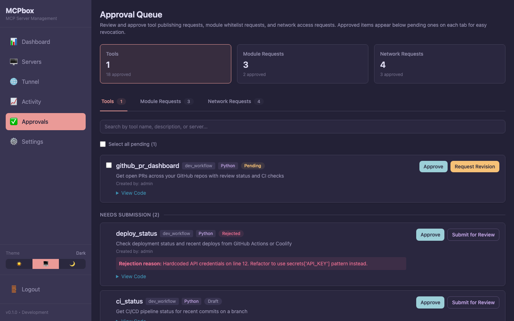
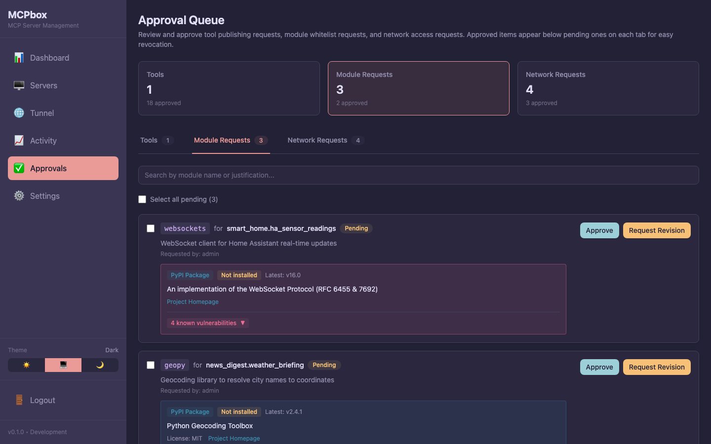
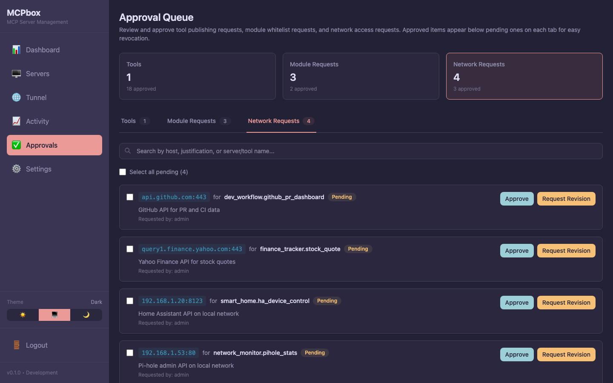

# Admin Approval Workflow

MCPBox requires human approval before any LLM-created code can run in production. This keeps you in control of what executes on your system.

## What Needs Approval

Three types of requests require admin review:

| Request Type | What the LLM does | What you review |
|-------------|-------------------|-----------------|
| **Tool publish** | `mcpbox_request_publish` | The tool's Python code, description, and the LLM's notes |
| **Module whitelist** | `mcpbox_request_module` | Which Python module is being requested and why |
| **Network access** | `mcpbox_request_network_access` | Which external host and port the tool wants to reach |

## Tool States

```
draft → pending_review → approved
                       → rejected (LLM can revise and re-submit)
```

- **Draft** — Just created, not visible to users, can be tested
- **Pending review** — Submitted for approval, appears in the Approvals page
- **Approved** — Can be registered with the sandbox and used
- **Rejected** — Not usable. The LLM receives the rejection reason and can revise the code.

{: .important }
Updating a tool's code after approval resets it to **pending_review**. This prevents approved tools from being silently changed.

## Reviewing in the Admin UI

1. Go to [http://localhost:3000](http://localhost:3000) and navigate to **Approvals**
2. Pending requests are grouped by type (tools, modules, network access)
3. For each tool request, you'll see:
   - The full Python source code
   - The tool's description
   - Notes from the LLM explaining the purpose
4. Click **Approve** or **Reject** (with an optional reason)


*Tool approval queue with pending, rejected, and approved tools.*


*Module whitelist requests showing package details and PyPI metadata.*


*Network access requests for external hosts and ports.*

## What to Look For

When reviewing tool code:

- **Network calls** — Does it only contact expected APIs? The `http` client blocks private IPs and metadata endpoints, but verify the URLs are reasonable.
- **Data handling** — Does it process sensitive data appropriately?
- **Module imports** — Are the imported modules appropriate for the task?
- **Secrets usage** — Does it use `secrets["KEY"]` only for expected keys?

Module and network access requests include a justification from the LLM explaining why the access is needed.

## After Approval

Once approved, the tool becomes available when its server is started. The LLM calls `mcpbox_start_server` to register the server's tools with the sandbox.

If you later want to revoke access, you can stop the server from the Servers page, or delete the tool entirely.
